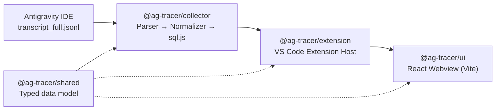

<div align="center">

# ⚡ Antigravity Tracer

**A DevTools panel for AI coding agents.**

See exactly what your AI agent did inside the Google Antigravity IDE — every tool call, every file it touched, every step, in order and in real time.


</div>

---

## Overview

AI coding agents like Antigravity move fast and mostly out of sight — you see the final diff, but not the trail of reads, writes, and tool calls that got there. **Antigravity Tracer** opens that up. It tails the agent's own execution logs and renders them as a live, scrollable timeline right inside the editor, so you can inspect what the agent actually did during a session rather than reconstructing it from memory.

## Installation

Search for **Antigravity Tracer** in the Extensions view — it's published on [Open VSX](https://open-vsx.org/extension/marbo786/antigravity-tracer). Alternatively, grab the `.vsix` from the [Releases](https://github.com/marbo786/AG_Tracer/releases) page and install it manually via **Extensions > Install from VSIX...**.

## Architecture

Antigravity Tracer is a monorepo with four workspaces, each with a single responsibility:



| Workspace | Responsibility |
|---|---|
| **`shared`** | Single source of truth for the data model — `Span`, `ToolCallRecord`, `FileAccessRecord`, `RawStep` — used across every layer |
| **`collector`** | Watches Antigravity's `transcript_full.jsonl` files. A **Parser** incrementally reads lines (tolerant of truncated/in-progress writes), a **Normalizer** turns raw steps into typed domain objects, and **Storage** persists them via `sql.js` (WebAssembly SQLite) — fast, deduplicated, ordered retrieval across IDE reloads with no native module compilation required |
| **`extension`** | The VS Code Extension Host layer. Manages the collector's lifecycle for "always-on" tracking, owns the Webview panel, and pushes live `spans:update` events over a typed messaging protocol |
| **`ui`** | The React + Vite frontend rendered in the VS Code Webview — an information-dense timeline view with virtualization for handling large sessions fluidly |

## Tech Stack

- **Language:** TypeScript across the entire stack
- **Editor integration:** VS Code Extension API
- **Frontend:** React, Vite
- **Storage:** sql.js (WebAssembly SQLite — no native build step)
- **Data flow:** Extension ↔ Webview messaging protocol; collector runs as a child process

## Getting Started

**Requirements:** Node.js >= 18

```bash
# 1. Install all workspace dependencies
npm install

# 2. Build everything (shared, ui, collector, extension)
npm run build:all
```

In VS Code, press **`F5`** to launch the Extension Development Host. Open the Command Palette (`Ctrl+Shift+P` / `Cmd+Shift+P`) and run **`Antigravity Tracer: Open Antigravity Tracer`**. The panel opens and automatically starts tailing `transcript_full.jsonl` files inside `~/.gemini/antigravity/brain/`.

## Contributing

This project is under active development as part of a personal portfolio. Issues and suggestions are welcome via the [issue tracker](https://github.com/marbo786/AG_Tracer/issues).

