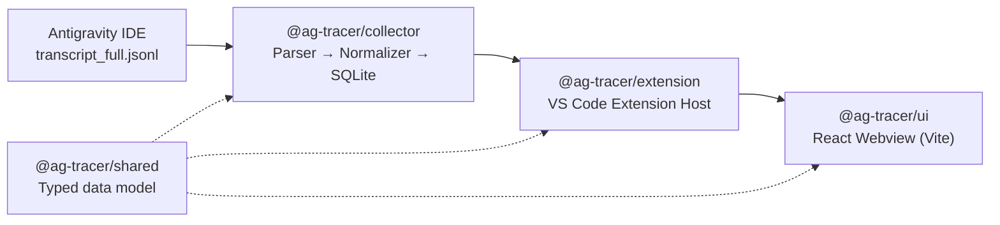

<div align="center">

# ⚡ Antigravity Tracer

**A DevTools panel for AI coding agents.**

See exactly what your AI agent did inside the Google Antigravity IDE — every tool call, every file it touched, every step, in order and in real time.


</div>

---

## Overview

AI coding agents like Antigravity move fast and mostly out of sight — you see the final diff, but not the trail of reads, writes, and tool calls that got there. **Antigravity Tracer** opens that up. It tails the agent's own execution logs and renders them as a live, scrollable timeline right inside VS Code, so you can inspect what the agent actually did during a session rather than reconstructing it from memory.

## Key Features

- 🔴 **Live tracking** — tails `transcript_full.jsonl` from Antigravity's `brain/` directory as the agent works, no polling or proxying required
- 🧭 **Step-by-step timeline** — every tool call, file read, and file write in the order it happened
- 🗂️ **Structured data model** — raw log entries are normalized into a typed schema (`Span`, `ToolCallRecord`, `FileAccessRecord`) decoupled from Antigravity's own log format
- ⚡ **Built for scale** — list virtualization in the UI keeps thousands of trace events smooth to scroll through
- 🎨 **Native feel** — respects VS Code's theme variables, so it looks like part of the editor, not a bolted-on panel

## Architecture

Antigravity Tracer is a monorepo with four workspaces, each with a single responsibility:



| Workspace | Responsibility |
|---|---|
| **`shared`** | Single source of truth for the data model — `Span`, `ToolCallRecord`, `FileAccessRecord`, `RawStep` — used across every layer |
| **`collector`** | Watches Antigravity's `transcript_full.jsonl` files. A **Parser** incrementally reads lines (tolerant of truncated/in-progress writes), a **Normalizer** turns raw steps into typed domain objects, and **Storage** persists them via `better-sqlite3` for fast, ordered, deduplicated retrieval across IDE reloads |
| **`extension`** | The VS Code Extension Host layer. Manages the collector's lifecycle for "always-on" tracking, owns the Webview panel, and pushes live `spans:update` events over a typed messaging protocol |
| **`ui`** | The React + Vite frontend rendered in the VS Code Webview — an information-dense timeline view with virtualization for handling large sessions fluidly |

## Tech Stack

- **Language:** TypeScript across the entire stack
- **Editor integration:** VS Code Extension API
- **Frontend:** React, Vite
- **Storage:** better-sqlite3 (native SQLite bindings)
- **Data flow:** Extension ↔ Webview messaging protocol; collector runs as a child process

## Getting Started

### Prerequisites

> **Native module note:** `@ag-tracer/collector` depends on `better-sqlite3`, which requires native compilation against the SQLite C library.

**On Windows**, if `npm install` fails with a `gyp ERR!`:
1. Install the Visual Studio Build Tools
2. Select the **"Desktop development with C++"** workload
3. Re-run `npm install`

*(This is also required on very recent Node.js versions, e.g. v24, where prebuilt binaries aren't yet available.)*

### Build from source

```bash
# 1. Install all workspace dependencies
npm install

# 2. Build the shared type definitions first
npx tsc -b shared

# 3. Build the UI
npm run build --workspace=ui

# 4. Build the extension and collector
npx tsc -b collector extension
```

### Run it

In VS Code, press **`F5`** to launch the Extension Development Host. The **Antigravity Tracer** view becomes available and automatically starts tailing `transcript_full.jsonl` files inside `~/.gemini/antigravity/brain/`.

## Roadmap

Planned, in priority order:

- [ ] **Execution graph** — visualize agent steps as a graph rather than a flat timeline
- [ ] **Workspace heatmap** — surface which files are touched most across sessions
- [ ] **Replay** — step back through a session as it happened
- [ ] **Decision attribution** — trace *why* the agent took a given action, backed by explicit evidence categories

## Project Structure

```
AG_Tracer/
├── shared/       # Typed data model shared across workspaces
├── collector/    # Log tailer: parser, normalizer, SQLite storage
├── extension/    # VS Code extension host
├── ui/           # React webview frontend
└── .agents/      # Agent configuration
```

## Contributing

This project is under active development as part of a personal portfolio. Issues and suggestions are welcome via the [issue tracker](https://github.com/marbo786/AG_Tracer/issues).

## License

No license has been set for this repository yet.
